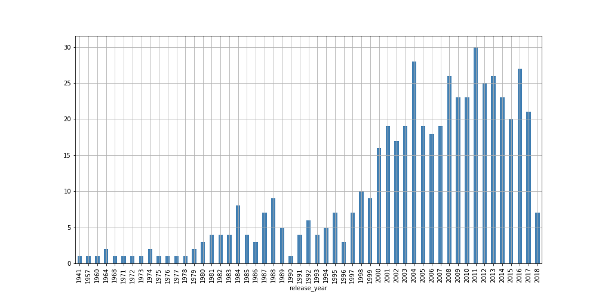

#### Distribution by release year

#### Most watched people
name|roles|count
---|---|---
Quentin Tarantino|actor, director, writer|18
Seth Rogen|actor, writer, director|17
Samuel L. Jackson|actor|17
Jackie Chan|actor, director, writer|15
Christopher Nolan|director, writer|15

#### Most watched directors
entity_name|imdb_id
---|---
Steven Spielberg|12
Christopher Nolan|8
Peter Jackson|7
Quentin Tarantino|7
Ridley Scott|6

#### Most watched writers
entity_name|imdb_id
---|---
Quentin Tarantino|10
George Lucas|8
Andrew Stanton|8
David S. Goyer|7
Gary Scott Thompson|7

#### Most watched actors
entity_name|imdb_id
---|---
Steven Spielberg|12
Christopher Nolan|8
Peter Jackson|7
Quentin Tarantino|7
Ridley Scott|6

#### Most watched studios
entity_name|imdb_id
---|---
Universal Pictures|60
Warner Bros.|58
Columbia Pictures Corporation|48
Walt Disney Pictures|48
Paramount Pictures|48

#### Most watched genres
entity_name|imdb_id
---|---
Action|267
Adventure|240
Drama|179
Sci-Fi|172
Thriller|167

#### People that have acted & written & directed
entity_name|actor|director|writer|min
---|---|---|---|---
Ben Stiller|5|2|2|2
Sylvester Stallone|7|2|3|2
Stephen Chow|2|2|2|2
Harold Ramis|3|2|3|2
Ben Affleck|8|2|2|2

